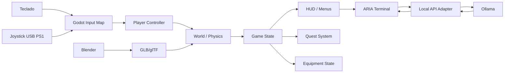

# CODEBASE.md — Laboratório 404

Documento consolidado do `codebase/` (anti-bloat). Substitui `STACK.md`, `ARCHITECTURE.md`, `CONVENTIONS.md`, `TESTING.md`, `INTEGRATIONS.md` e `CONCERNS.md` enquanto o projeto permanecer pequeno. Registrado em `STATUS.md`.

## Stack

| Camada | Tecnologia | Versão |
|---|---|---|
| Motor / gameplay | Godot + GDScript | 4.5 (`4.5.stable.official.876b29033`) |
| Assets | Blender → GLB/glTF | 5.2.1 LTS |
| Adapter ARIA | Python + FastAPI + uvicorn + requests + pydantic | Python 3.12 (venv `.venv/`) |
| LLM | Ollama | `llama3.2:3b` (A CONFIRMAR no ambiente) |

Sem banco de dados; estado persistido no próprio jogo (POC 6).

## Arquitetura

### Responsabilidades
- **Blender:** modelagem, UV, materiais, rigging, animação, exportação.
- **Godot:** gameplay, física, input, UI, áudio, cenas, estados, salvamento, validação.
- **Ollama:** inferência local e respostas de ARIA.
- **Adaptador:** converte mensagens do jogo para o modelo e restringe o retorno.

### Scripts
**POC 1:** `main.gd` (coordenador), `player_controller.gd`, `interaction.gd`, `hud.gd`, `pause_menu.gd`, `input_diagnostic.gd`.
**POC 2:** `interactable.gd`, `inventory.gd`, `equipment.gd`, `door.gd`, `lab_setup.gd` (liga o GLB à missão).
**POC 3:** `aria_client.gd` (timeout/fallback/intents), `aria_terminal.gd`, `aria_adapter.py` (FastAPI + pydantic).
**POC 4:** `npc.gd`, `world_events.gd`, `memory_store.gd` (4 camadas).
**POC 5:** `lab_generator.gd` (módulos, seed, BFS).
**POC 6:** `tutorial.gd`, `vertical_slice.gd`, `epilogue.gd`, `epilogue_ui.gd`, `save_system.gd`, `sfx.gd`.
**Visual (2026-09-10):** `security_camera.gd` (câmera de segurança que acompanha o jogador após a energia voltar); `main.tscn` com `Environment` de contraste alto + neblina e `Level` com `Lights`/`Accents`/`Labels`/`CAM_Security`.
**Globais:** autoloads `Lab404Game` (`game.gd`) e `Lab404Sfx` (`sfx.gd`); `game_state.gd`, `quest_manager.gd` instanciados pelo autoload.
**Ferramentas:** `tools/gen_audio.py` (WAV originais), `tools/` vazio fora isso; testes em `tests/`.

## Convenções

- **Input:** ações semânticas do Input Map; nunca índices de botão.
- **GDScript:** `class_name`, `@export`, sinais; 4 espaços; manter esqueletos.
- **Blender:** 1 u = 1 m; aplicar transform; prefixos `ENV_`/`PROP_`/`INT_`/`COL_`/`FX_`/`NPC_`/`DEC_`; GLB.
- **Python:** tipagem, pydantic, exceções → fallback.
- **Cenas:** conforme `scenes/SCENE_TEMPLATES.md` (`main.tscn`, `player.tscn`, `level_poc1.tscn`, `hud.tscn`, `pause_menu.tscn` e `input_test.tscn` implementadas no POC 1).

## Testing

Fonte de verdade: `docs/TESTES.md`. Níveis de evidência: **LOCAL** (atual — POC 1–6 com 209 verificações Godot + 16 do adapter, todas PASS), **CI**, **STAGING**, **PRODUÇÃO**.

Comandos:
- `tests/run_all.sh` — suíte completa: POC 1–6 (Godot headless) + `tests/test_aria_adapter.py` (venv).
- `godot4 --headless --path . res://tests/pocN_test.tscn` — uma cena de teste isolada.
- `LAB404_SHOT_PATH=$HOME/lab404.png godot4 --path . res://tests/screenshot.tscn` — evidência visual + FPS.
  Variáveis extras: `LAB404_SHOT_POSE="x,y,z,yaw"` (posiciona o jogador antes da captura) e `LAB404_SHOT_DUMP=1` (imprime luzes/letreiros/câmera).
- Smoke: `godot4 --headless --path . --quit-after 240`.
- Adapter: `.venv/bin/uvicorn scripts.aria_adapter:app --port 8000`; testes: `.venv/bin/python tests/test_aria_adapter.py`.

- **POC 1:** input (teclado, joystick, deadzone, botões X/O/Start, hotplug), movimento (colisão, gravidade, câmera, limite de velocidade).
- **POC 2:** coleta, interação, inventário, porta, painel, missão, feedback.
- **POC 3:** Ollama disponível, timeout, modelo inexistente, resposta inválida, JSON malformado, modelo lento, servidor desligado.
- **POC 4:** estado persistente, NPC, evento, diálogo contextual.
- **POC 5:** seed reproduzível, módulos conectados, nenhuma sala inacessível, pontos alcançáveis.
- **POC 6:** início ao fim, controles explicados, joystick/teclado, áudio, save, recuperação após erro, build limpa.

Gate mínimo por tarefa: build sem erros de script + testes disponíveis executados + critérios de aceite relevantes verificados.

## Integrações

- **Ollama** (`http://127.0.0.1:11434/api/chat`): chamada pelo adapter com `timeout=30`.
- **Adapter** (`http://127.0.0.1:8000/chat`): consumido pelo `aria_client.gd`. Contrato em `SPECIFICATION.md` §6.
- **Blender MCP**: exportação GLB → `assets/`/`scenes/`.

## Concerns (riscos e mitigação)

| Risco | Mitigação |
|---|---|
| Mapeamento de joystick varia por adaptador | Input Map + `InputTest` (FR-007, FR-008) |
| LLM lenta/indisponível | timeout 30 s + fallback (NFR-004, FR-018) |
| Sem GPU dedicada | geometria/texturas simples, LLM pequena (NFR-001, NFR-003) |
| Versões não confirmadas | marcar `A CONFIRMAR` até fechamento do POC |
| Estado compartilhado/eventos (POC 4+) | separar memória de sessão × estado persistente × narrativa × histórico (FR-023) |
