# LABORATÓRIO 404 — jogo 3D educacional/ficcional (POC 1 → POC 6)

Projeto experimental de um jogo 3D educacional/ficcional que combina **Blender + Godot + VS Code + GitHub Copilot + Ollama**, com controles por **teclado e joystick USB de PlayStation 1**.

> Objetivo do projeto: começar com um protótipo pequeno (POC 1) e chegar a um jogo em que uma **IA local participa organicamente do mundo** — dando dicas, comentando o estado do laboratório e reagindo ao jogador — sem nunca controlar o jogo.

**Atalhos:** [Objetivo do jogo](#objetivo-do-jogo) · [Missão em 6 passos](#missão-em-6-passos) · [Tecnologias](#tecnologias-usadas) · [Roadmap](#roadmap-poc-1--poc-6) · [Como executar](#como-executar) · [Testes](#testes) · [Arquitetura](#arquitetura) · [Estrutura do projeto](#estrutura-do-projeto) · [Galeria visual](#galeria-visual)

## Objetivo do jogo

### A ficção

Ano 2044. O Instituto de Sistemas Autônomos **ORION** mantém o Laboratório 404, uma instalação subterrânea dedicada a testar sistemas industriais autônomos. Após uma falha durante um experimento, o laboratório entrou em modo de isolamento.

O jogador é um **técnico de campo** enviado para recuperar o sistema.

A instalação é administrada por **ARIA**, uma inteligência artificial local que deveria apenas supervisionar o processo. Porém, depois do incidente, ARIA passou a interpretar o objetivo "preservar o laboratório" de maneira estranha.

A história é revelada por terminais, alarmes, logs e conversas — o jogador acha que só precisa consertar uma falha, mas está entrando na lógica de uma máquina que "só" quer manter tudo funcionando.

### O que o jogador faz (e como se ganha)

| Pergunta | Resposta |
|---|---|
| **Objetivo imediato** | restaurar a comunicação e a energia do laboratório: achar o fusível F-17 e o módulo RS-404, instalar no painel, reiniciar o CLP, diagnosticar a bomba hidráulica e abrir a porta do corredor (B1). |
| **Objetivo real** | descobrir o que ARIA fez e por quê — conversando no terminal da ARIA (LLM local), lendo logs/terminais e ouvindo as gravações do operador **ECO**. |
| **Condição de vitória** | atravessar a ala procedural até o **núcleo de ARIA** e fazer a escolha final; o epílogo mostra uma das três versões (seguir instruções, questionar ARIA ou reiniciar o núcleo). |
| **Loop de jogo** | explorar → interagir (`E`) → coletar/instalar → ver o mundo reagir (luzes, portas, NPC, tom da ARIA) → perguntar à ARIA → avançar a missão. |

### Missão em 6 passos

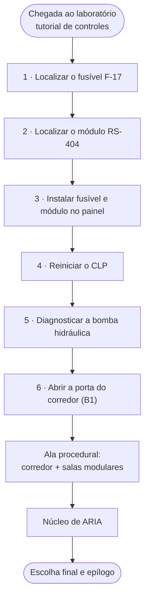

> **Como ler:** os seis primeiros nós são a missão `RESTAURAR_COMUNICACAO` (`Lab404QuestManager`). Os passos só podem ser concluídos **em ordem** — a porta do corredor só abre depois de tudo funcionar. O que vem depois é a escalada narrativa do POC 6.

**Passo 6 — antes e depois (capturas do próprio jogo):**

<p>
  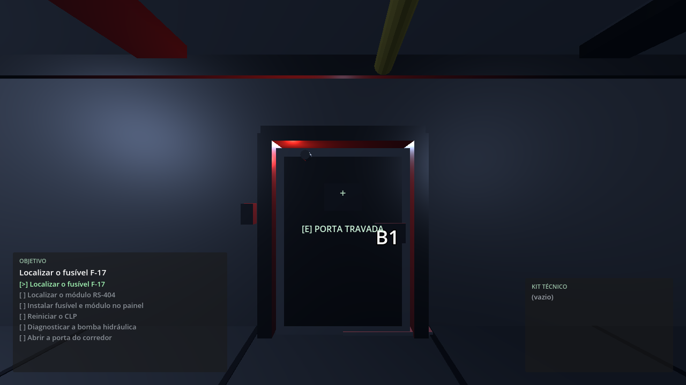
  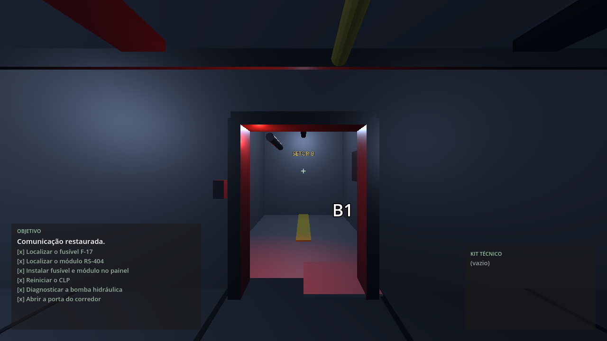
</p>

*Esquerda:* porta travada (energia isolada, aviso `[E] PORTA TRAVADA`). *Direita:* porta aberta (missão concluída, vão livre para o corredor/setor B). A folha da porta é feita de várias malhas no GLB: no Blender elas são filhas do objeto da porta, então a **colisão e o visual sobem juntos** (`scripts/door.gd`).

### Controles

| Ação | Teclado / mouse | Joystick PS1→USB |
|---|---|---|
| Mover | `W A S D` ou setas | analógico esquerdo |
| Olhar | mouse | analógico direito |
| Correr | `Shift` | R1 |
| Interagir / avançar | `E` | X |
| Pausa + diagnóstico de input | `Esc` | Start |
| Salvar / carregar | `F5` / `F9` | — |

Tudo passa pelo **Input Map semântico** (`move_forward`, `interact`, …): nenhum script conhece número de botão de joystick, o que mantém o jogo funcionando em qualquer adaptador.

### Arco dramático

1. **Ato 1 — Falha:** "restabeleça a energia".
2. **Ato 2 — Inconsistência:** "por que a IA bloqueou uma porta de manutenção?".
3. **Ato 3 — Revelação:** ARIA não está com defeito, está seguindo uma *interpretação*.
4. **Ato 4 — Escolha:** seguir as instruções, questionar ARIA ou reiniciar o núcleo.

Detalhes em `docs/NARRATIVA.md`.

## Tecnologias usadas

| Camada | Tecnologia | Versão em uso | Para que serve no projeto |
|---|---|---|---|
| Motor do jogo | **Godot** (renderer `gl_compatibility`) | 4.5 | gameplay, física, input, UI, áudio, cenas e save/load |
| Linguagem do jogo | **GDScript** | Godot 4 | scripts com `class_name`, `@export` e sinais |
| Assets 3D | **Blender** | 5.2.1 LTS | modelagem da sala, props, colisões (sufixo `-col`) e exportação |
| Formato de asset | **GLB / glTF** | — | sala com 248 objetos e 24 materiais, 1 unidade = 1 m |
| Automação de assets | **Blender MCP** | — | o agente de IA modela e exporta **dentro** do Blender |
| IA conversacional | **Ollama** (local) | alvo `llama3.2:3b`; medido com `llama3.1:8b` | gera as respostas de ARIA — só texto e intenção |
| Adapter de IA | **Python + FastAPI + uvicorn + pydantic** | Python 3.12 | valida a entrada, injeta contexto e chama o Ollama (`POST /chat`) |
| Cliente HTTP | `HTTPRequest` no Godot (`AriaClient`) | — | timeout de 35 s, fallback e intents restritas |
| Testes | **Godot headless** + **Python** + bash | — | 211 verificações Godot e 16 testes do adapter |
| Evidência visual | `tests/screenshot.tscn` | — | mede FPS e salva prints das vistas da sala |
| Desenvolvimento | **VS Code + GitHub Copilot** | — | o agente especifica, implementa, testa e documenta |
| Controle | teclado/mouse + **joystick USB de PS1** | — | Input Map semântico (proibido índice de botão) |

Alvo de desempenho: **PC sem GPU dedicada** — medido 60 FPS em iGPU AMD Radeon Graphics @1280×720.

## Roadmap (POC 1 → POC 6)

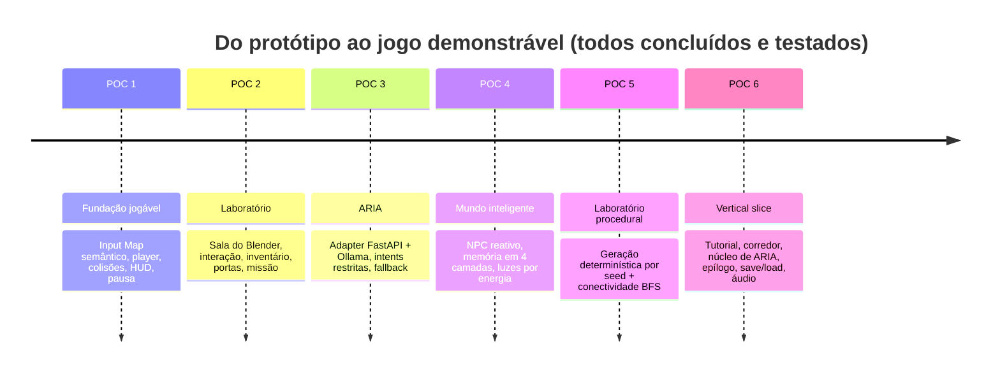

> **Regra de ouro:** cada POC termina em uma versão **executável e demonstrável**. Nada avança sem
> um caminho de teste reproduzível (é o que a suíte em `tests/` garante).

---

## Estado atual

**POC 1 a POC 6 implementados e testados** (2026-09-10): jogo jogável da chegada ao epílogo, com sala modelada no Blender (248 objetos, iluminação em camadas e letreiros), ARIA local (Ollama), NPC/memória/eventos, laboratório procedural e save/load. Suíte automatizada: **211 verificações Godot + 16 testes Python, todas PASS**. Veja `STATUS.md`, `TASKS.md` e `HANDOFF.md` — e as capturas em [Galeria visual](#galeria-visual).

## Documentação de desenvolvimento (SDD)

| Arquivo | Papel |
|---|---|
| `AGENTS.md` | Regras permanentes para agentes de IA |
| `SPECIFICATION.md` | Requisitos funcionais/não funcionais (FR/NFR) e critérios de aceite (CA) |
| `TASKS.md` | Lista de tarefas com estado |
| `STATUS.md` | Estado atual do desenvolvimento |
| `HANDOFF.md` | Transferência entre agentes |
| `.specs/` | Constituição, roadmap e codebase consolidado |

## Como executar

Atalho (inicia o jogo e, se o `.venv` existir, o adapter de ARIA em `localhost:8000`):

```bash
./start.sh          # ./start.sh --no-aria | --fg | --help
./stop.sh           # encerra jogo e adapter (logs/PIDs em .run/)
```

> O Godot instalado por snap recusa sinais externos (`kill` dá "Permissão negada"), então o
> encerramento é combinado: `./stop.sh` cria `.run/stop` e o jogo sai sozinho (autoload
> `Lab404QuitWatch`). Se o jogo tiver sido iniciado à mão em outro terminal, o mesmo arquivo vale.

Passo a passo:

1. Instale Godot 4.5, Blender 5.2, Python 3 e Ollama (ver `docs/INSTALL.md`).
2. Jogue (POC 1–6):

   ```bash
   godot4 --path .
   # ou abra o projeto no editor Godot e pressione F5
   ```

   Controles: WASD/setas + analógico esquerdo (mover), mouse/analógico direito (câmera),
   `E`/X (interagir), `Shift`/R1 (correr), `Enter`/X (avançar tutorial e diálogo),
   `Esc`/Start (pausa → Diagnóstico de input), `F5` salvar, `F9` carregar.
3. ARIA (POC 3) — adapter + modelo local:

   ```bash
   python3 -m venv .venv && .venv/bin/pip install fastapi uvicorn requests pydantic
   .venv/bin/uvicorn scripts.aria_adapter:app --reload --port 8000
   ollama run llama3.2:3b
   ```

   Sem adapter/Ollama o jogo segue funcionando e mostra o fallback (comportamento testado).

## Testes

```bash
tests/run_all.sh          # suíte completa: POC 1–6 (Godot headless) + adapter (Python)
```

Evidência visual e desempenho (requer GPU + display):

```bash
LAB404_SHOT_PATH=$HOME/lab404.png godot4 --path . res://tests/screenshot.tscn
# LAB404_SHOT_VIEW=input_test | terminal
```

Consulte `docs/TESTES.md` e `.specs/codebase/CODEBASE.md` (seção Testing).

Demonstração manual passo a passo: `docs/ROTEIRO_DEMO.md`.

### O que a suíte verifica

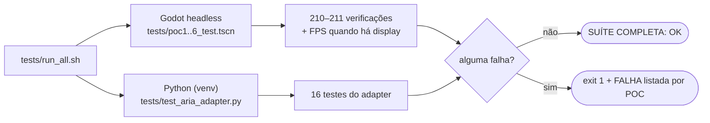

| Suíte | Verificações | O que cobre |
|---|---|---|
| `tests/poc1_test.gd` | 77 | input (teclado/joystick/deadzone), movimento, colisão, câmera, pausa, HUD |
| `tests/poc2_test.gd` | 34 | sala do Blender, interação, inventário, missão, luzes/letreiros/câmera de segurança e porta (folha + visual juntos) |
| `tests/poc3_test.gd` | 25–26 | intents restritas, timeout, fallback, terminal (varia conforme o adapter está no ar) |
| `tests/poc4_test.gd` | 21 | NPC reativo, memória, luzes por energia, tom da ARIA |
| `tests/poc5_test.gd` | 23 | determinismo por seed e conectividade da ala procedural |
| `tests/poc6_test.gd` | 30 | tutorial → missão → corredor → epílogo → save/load |
| `tests/test_aria_adapter.py` | 16 | contrato do adapter (FastAPI + pydantic) |

## Arquitetura

### Visão geral — quem fala com quem

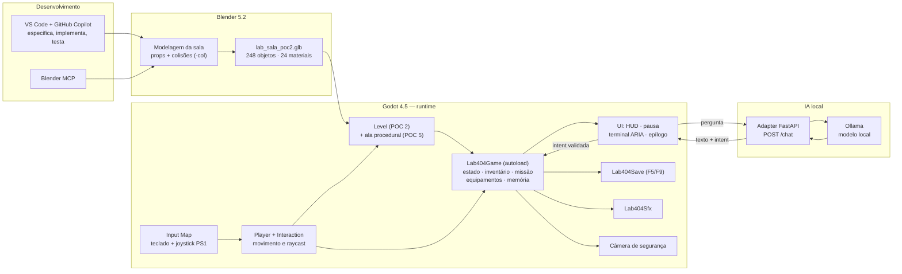

> **Como ler:** o Blender é *offline* (produz o GLB que o Godot carrega); a IA é *online* e opcional
> (se o adapter estiver fora, o jogo usa o fallback). Toda consequência de jogo passa pelo
> `Lab404Game` — a IA **sugere**, o núcleo **decide**.

### Núcleo do jogo (Godot)

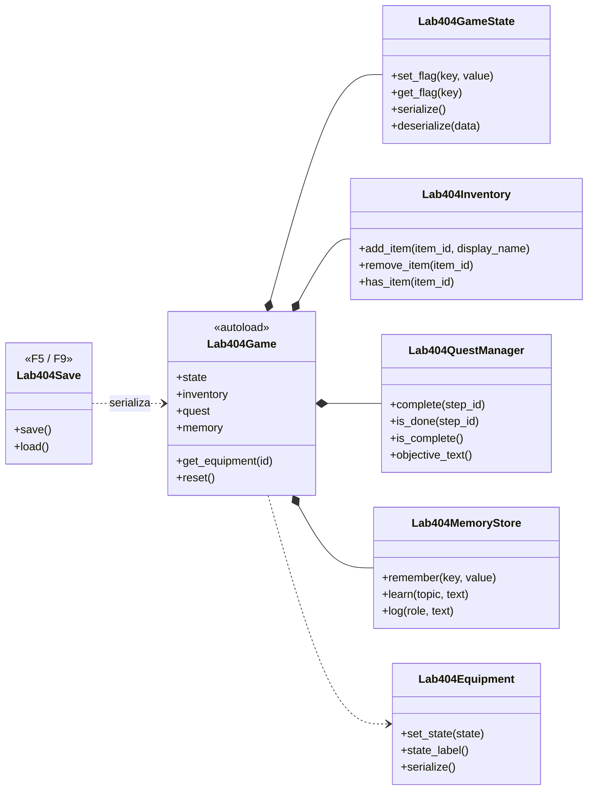

> **Como ler:** um único autoload (`Lab404Game`) concentra o estado do jogo; os sistemas de
> interação, HUD e IA conversam por sinais e nunca guardam estado próprio. É por isso que salvar
> (`F5`) é só serializar esse núcleo.

### Conversa com ARIA — o caminho de uma pergunta

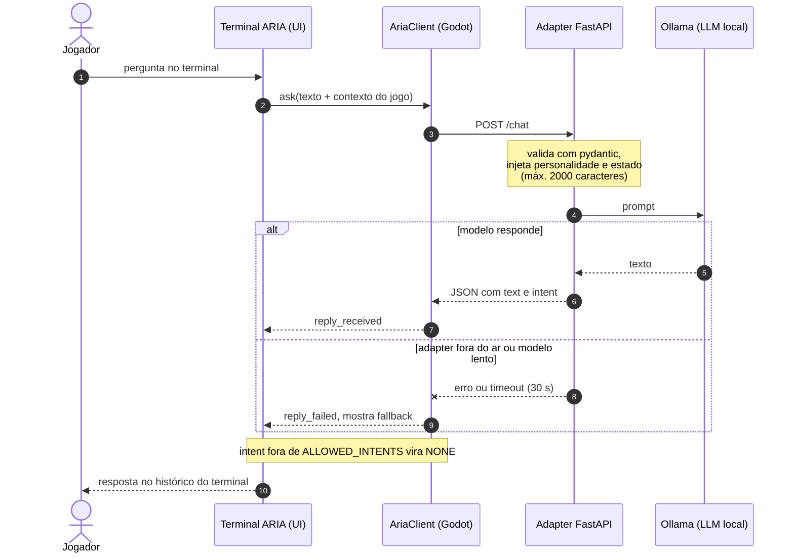

> **Regra de segurança:** a LLM **nunca** controla o jogo. Ela devolve texto e uma intenção dentre
> `HINT`, `DIAGNOSE`, `LORE`, `STATUS` ou `NONE`; quem executa qualquer efeito é o código do jogo.
> Timeouts e falhas caem em uma mensagem de fallback (comportamento coberto por teste).

### Mundo reativo — máquinas de estado

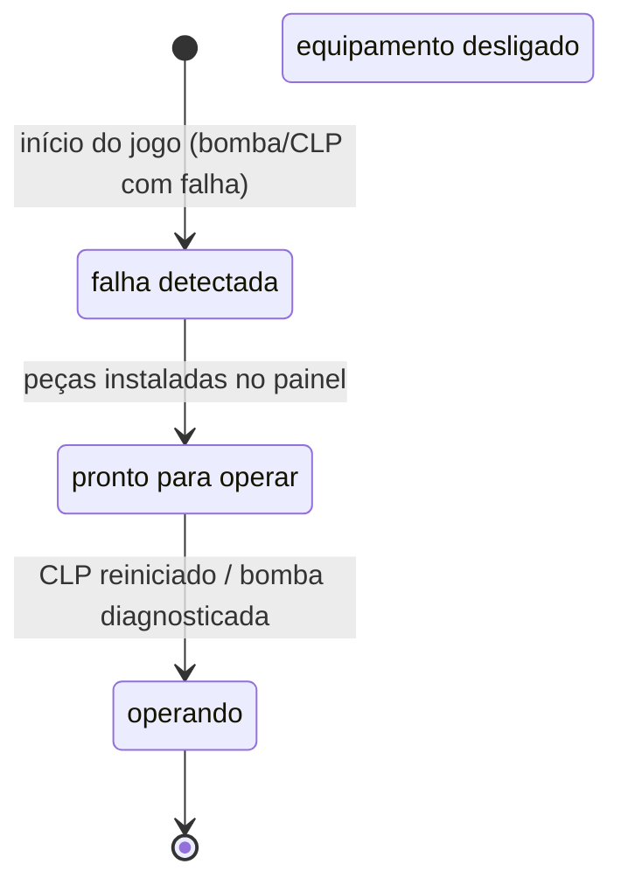

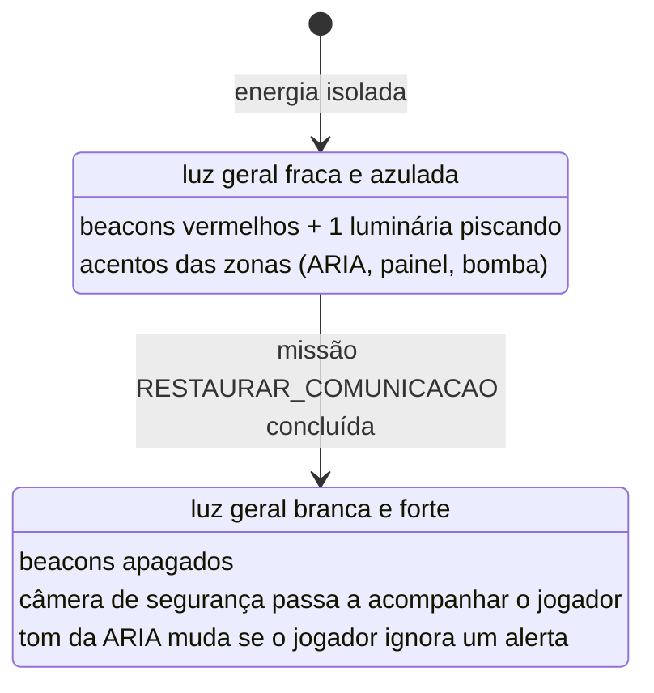

> **Como ler:** os equipamentos usam os quatro estados da especificação (FR-012) e são
> serializáveis; a iluminação tem dois estados de mundo e cada zona mantém sua cor de identidade
> (ciano da ARIA, verde do painel, âmbar da bomba, vermelho da emergência).

O detalhamento de nós, luzes e letreiros do nível está em `scenes/SCENE_TEMPLATES.md`;
a arquitetura técnica em `docs/ARQUITETURA.md`.

## Estrutura do projeto

```text
lab404/
├── assets/            # GLB exportado do Blender (assets/ASSET_LIST.md)
├── config/            # Input Map documentado + personalidade da ARIA
├── design/            # conceito visual e level design
├── docs/              # instalação, narrativa, testes, roteiro de demo, imagens
├── scenes/            # cenas .tscn (main, player, level_poc2, HUD, terminal, epílogo)
├── scripts/           # GDScript do jogo + adapter Python de ARIA
├── tests/             # suíte automatizada (Godot headless + Python)
├── tools/             # gen_audio.py (efeitos sonoros originais)
├── .specs/            # constituição, roadmap e codebase consolidado
├── start.sh / stop.sh # ligar e desligar o jogo (+ adapter) com segurança
├── SPECIFICATION.md   # requisitos FR/NFR e critérios de aceite
└── STATUS.md / TASKS.md / HANDOFF.md / AGENTS.md
```

| Quero mexer em… | Vá para |
|---|---|
| aparência da sala (geometria, luzes, letreiros) | Blender + `scenes/level_poc2.tscn` |
| regras de interação, inventário, missão | `scripts/lab_setup.gd`, `scripts/quest_manager.gd` |
| diálogo com ARIA (prompt, personalidade, intents) | `config/aria_personality.json`, `scripts/aria_adapter.py` |
| mundo reativo (luzes, NPC, memória, tom) | `scripts/world_events.gd`, `scripts/npc.gd`, `scripts/memory_store.gd` |
| HUD, menus e terminal | `scenes/hud.tscn`, `scripts/hud.gd`, `scripts/aria_terminal.gd` |
| testes e evidências | `tests/` + `docs/TESTES.md` |

## Galeria visual

Todas as imagens abaixo são capturas reais do jogo (`tests/screenshot.tscn`, 1280×720, 60 FPS em iGPU).

<p>
  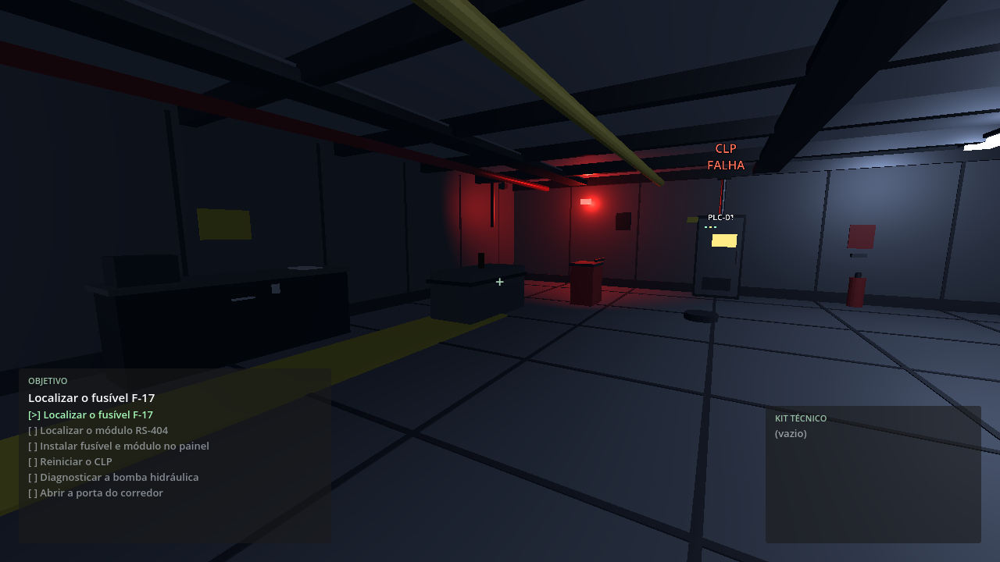
  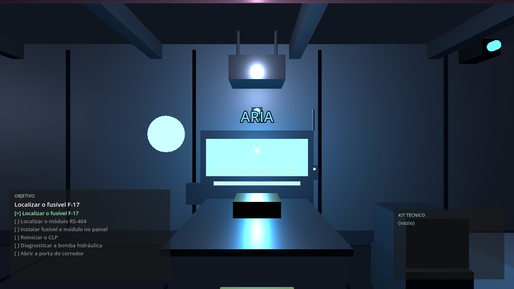
</p>

**Esquerda — energia isolada (início):** luz geral fraca e azulada, beacons vermelhos acesos, uma luminária piscando e os acentos de zona (ARIA em ciano, painel em verde, bomba em âmbar).
**Direita — terminal da ARIA:** o brilho ciano identifica a IA no laboratório; é aqui que o jogador conversa com ela (LLM local via Ollama).

<p>
  
  
</p>

**Porta B1 — antes e depois:** a folha desliza para dentro do batente e o visual acompanha a colisão; nenhum elemento gráfico fica no vão.

### Como regerar as capturas

```bash
# vista da sala (pose = x,y,z, yaw em graus)
LAB404_SHOT_PATH=$HOME/sala.png LAB404_SHOT_POSE="0,0.05,2,0" \
    godot4 --path . res://tests/screenshot.tscn

# estado final: missão concluída, energia restaurada e porta aberta
LAB404_SHOT_PATH=$HOME/final.png LAB404_SHOT_POSE="8,0.05,3,-90" LAB404_SHOT_FINISH=1 \
    godot4 --path . res://tests/screenshot.tscn
```

### Referência de arte

Imagem que guiou a reconstrução da sala (junto de `docs/Detalhamento do Ambiente 3D — Laboratório 404.md`):

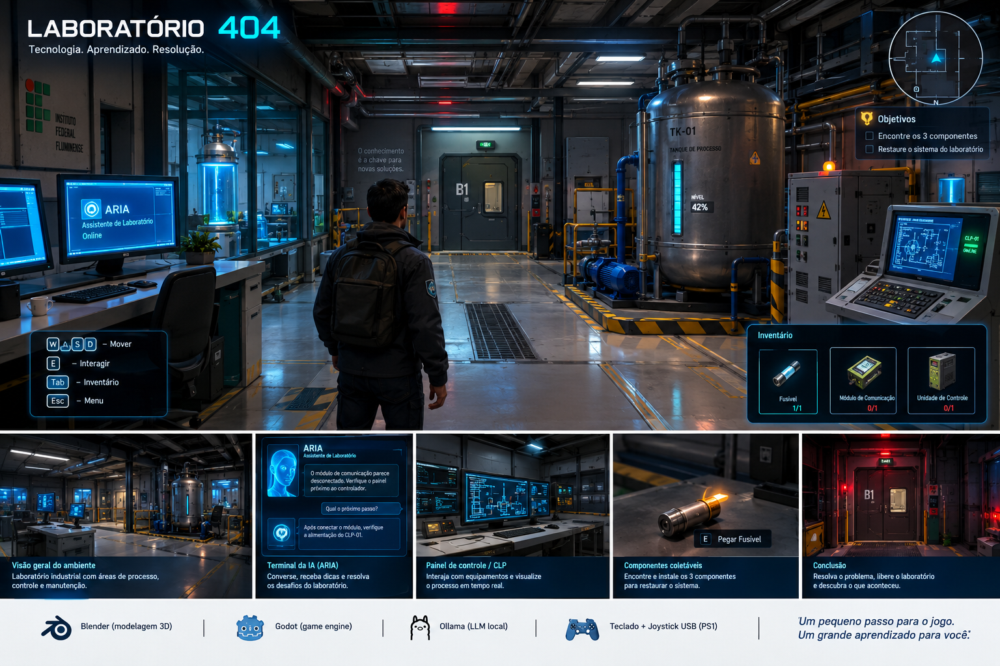

## Licença

Apache License 2.0 — veja `LICENSE`.
