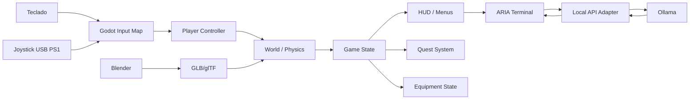

# Arquitetura técnica



## Separação de responsabilidades

### Blender
Modelagem, UV, materiais, rigging, animações e exportação.

### Godot
Gameplay, física, input, UI, áudio, cenas, estados, salvamento e validação.

### Ollama
Inferência local e geração de respostas de ARIA.

### Adaptador
Converte mensagens do jogo para o formato do modelo e restringe o retorno.

## Estrutura sugerida

```text
lab404/
├── assets/
├── scenes/
├── scripts/
│   ├── player/
│   ├── interaction/
│   ├── quests/
│   ├── equipment/
│   ├── ai/
│   └── ui/
├── data/
├── audio/
├── shaders/
└── tests/
```
